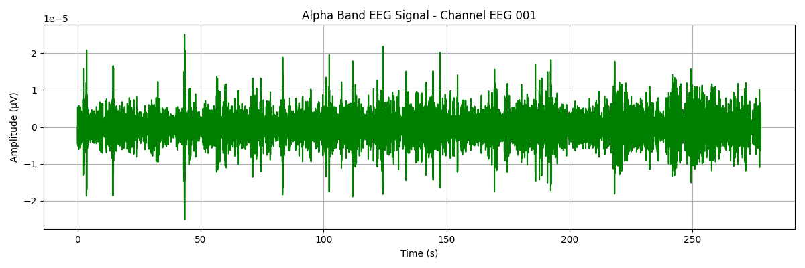

# 🧠 EEG Alpha Wave Detector (8–13 Hz)

This project uses **Python and the MNE library** to load, filter, and visualize EEG brain signals — specifically targeting **alpha wave activity** (8–13 Hz). Alpha waves are linked to **relaxation, meditation, and quiet wakefulness**.

[](https://colab.research.google.com/github/Reem-Aboutaleb/eeg-alpha-wave-detector/blob/main/alpha_wave_analysis.ipynb)

---


> **Keywords**: EEG, Alpha Waves, Biomedical Signal Processing, MNE-Python, Frequency Filtering, Brain Activity, NeuroTech

---

## 📚 Table of Contents

- [Overview](#-eeg-alpha-wave-detector-813-hz)
- [What This Project Does](#-what-this-project-does)
- [Tools Used](#-tools-used)
- [Sample Output](#-sample-output)
- [How to Run](#-how-to-run)
- [Files](#-files)
- [Future Work](#-future-work)
- [Key Takeaways](#-key-takeaways)
- [Author](#-author)

---

## 🚀 What This Project Does

- ✅ Loads real EEG data from the MNE sample dataset  
- ✅ Applies bandpass filtering to isolate alpha wave activity (8–13 Hz)  
- ✅ Visualizes filtered alpha band signals from selected channels  
- ✅ Runs in Jupyter or Google Colab

---

## 🔬 Tools Used

- **Python 3.11**  
- [MNE-Python](https://mne.tools/stable/index.html)  
- **NumPy**, **Matplotlib**  
- **Google Colab** / Jupyter Notebook  
- Git & GitHub for version control

---

## 📈 Sample Output

### 🖼️ Alpha Band EEG Plot



---

### 🎥 Demo

Preview of the alpha wave detection process in action:


---

## ▶️ How to Run

1. Clone the repository:
```bash
git clone https://github.com/Reem-Aboutaleb/eeg-alpha-wave-detector.git
cd eeg-alpha-wave-detector
```

2. Install required packages:
```bash
pip install mne numpy matplotlib
```

3. Open the notebook:
   - `alpha_wave_analysis.ipynb` in **Jupyter** or **Colab**

---

## 📁 Files

| File                         | Description                          |
|-----------------------------|--------------------------------------|
| `alpha_wave_analysis.ipynb` | Main notebook for alpha wave analysis |
| `images/alpha_wave_plot.png`| Alpha band signal visualization      |
| `images/eeg_demo.gif`       | Notebook demo preview                |
| `README.md`                 | Project documentation                |

---

## 🔭 Future Work

- Add **Power Spectral Density (PSD)** comparison between bands  
- Generate **alpha heatmaps** across multiple EEG channels  
- Extend to theta, beta, and delta frequency ranges  
- Build a **Streamlit dashboard** for interactive exploration  
- Use alpha power to estimate **relaxation or stress states**

---

## 🧠 Key Takeaways

- Learned to isolate alpha wave activity from EEG signals  
- Practiced using MNE-Python for biomedical signal filtering  
- Built a clean visualization pipeline for cognitive rhythms  
- Prepared for real-time EEG tools and neurotech applications

---

## 👩‍⚕️ Author

**Reem Aboutaleb**  
Biomedical Engineering M.S. Candidate @ NYU Tandon  
📧 Reemwalid222@gmail.com  
🔗 [GitHub](https://github.com/Reem-Aboutaleb) | [LinkedIn](https://www.linkedin.com/in/reem-aboutaleb)

---

⭐ *“Your brain speaks in waves — alpha is its quiet, focused voice.”*


