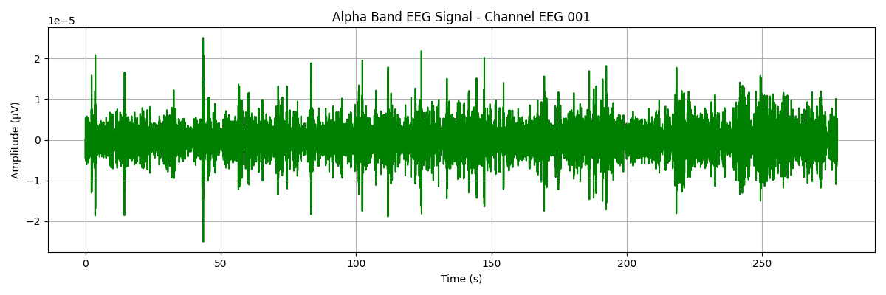

# 🧠 EEG Alpha Wave Detector

This project uses Python and the MNE library to load, filter, and visualize EEG brain signals — specifically targeting **alpha wave activity** (8–13 Hz). Alpha waves are linked to relaxation, meditation, and quiet wakefulness.

 <!-- optional: replace with actual image later -->

---

## 🚀 What This Project Does

- ✅ Loads real EEG data from the MNE sample dataset  
- ✅ Filters signals to isolate alpha band frequencies  
- ✅ Visualizes clean alpha waveforms from EEG channel data  
- ✅ Built using Jupyter Notebook (runs in Colab)

---

## 🔬 Tools Used

- **Python 3**
- [MNE](https://mne.tools/stable/index.html) — for EEG signal processing
- **Matplotlib** — for signal plotting
- **Google Colab** — for cloud-based execution
- Git & GitHub — for version control and publishing

---

## 📊 How to Run

You can run the full notebook instantly using Google Colab:

👉 [**Open in Colab**](https://colab.research.google.com/github/Reem-Aboutaleb/eeg-alpha-wave-detector/blob/main/alpha_wave_analysis.ipynb)

---

## 📁 Files

| File                         | Description                          |
|-----------------------------|--------------------------------------|
| `alpha_wave_analysis.ipynb` | Main notebook with full pipeline     |
| `README.md`                 | This file                            |

---

## 💡 Future Ideas

- Compute and compare power across EEG bands  
- Visualize alpha power heatmaps across channels  
- Build a Streamlit dashboard for interactive EEG exploration

---

## ✨ Author

Made with 💚 by [Reem Aboutaleb](https://github.com/Reem-Aboutaleb)

